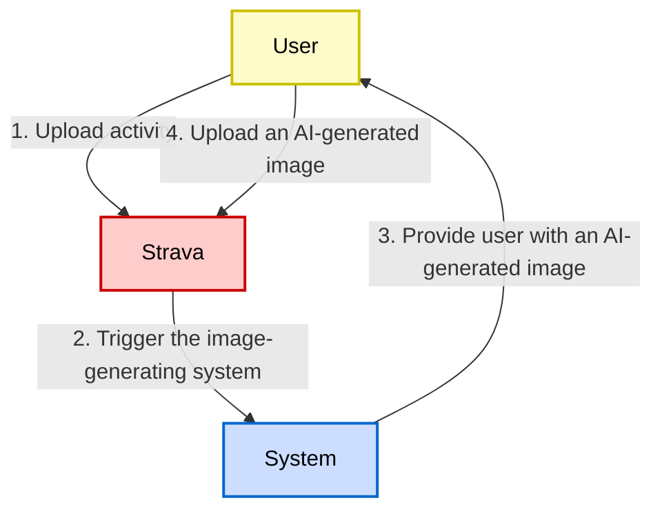

# Project Context

## Purpose

TORQ (**T**raining **O**rbit **R**esearch **Q**ernel) is an AI-powered Strava activity image generator that automatically transforms workout data into visually compelling, shareable images. The system analyzes Strava activity data and context to create personalized, expressive visuals for each activity, helping athletes present their performance and stories in a more engaging way.

## Key Goals

- Automatically generate AI images from Strava activity data
- Create safe, appropriate, and visually appealing content
- Provide athletes with shareable, personalized workout visuals
- Maintain strict content guardrails and safety measures

## Tech Stack
- **Runtime**: Bun (v1.3.6+) - Primary JavaScript/TypeScript runtime
- **Language**: TypeScript (v5.9.3) with strict mode enabled
- **Node Version**: 24.x (for compatibility when needed)
- **Package Manager**: Bun workspaces for monorepo structure
- **Testing**: Bun test (preferred over Jest)
- **Specification System**: OpenSpec (v0.20.0) for formal specifications
- **Build System**: Bun's built-in bundler
- **Module System**: ESNext modules (type: "module")

## Project Conventions

### Code Style
See the `check-code-style` skill in `.claude/skills/check-code-style/SKILL.md` for comprehensive code patterns and organization guidelines.

### Linting
See the `lint` skill in `.claude/skills/lint/SKILL.md` for ESLint configuration and how to fix linting errors.

### Testing
See the `test` skill in `.claude/skills/test/SKILL.md` for test-driven development patterns and requirements.

### Architectual Patterns
- **Modular Architecture**: Modules with clear boundaries
- **Dependency Injection**: Explicit dependencies injected into modules
- **Single Responsibility Principle**: Each module has one clear purpose
- **Interface-First Design**: Well-defined TypeScript interfaces for all modules
- **Specification-Driven Development**: Formal specs guide implementation
- **Guardrails Pattern**: Validation modules for activity and specs content safety

### Git Workflow
- **Repository**: GitHub (github.com/torqlab/torq)
- **Branch Strategy**: Feature branches with descriptive names
- **Commit Conventions**: Clear, descriptive commit messages
- **Code Review**: Required before merging to main
- **CI/CD**: GitHub Actions for automated testing and validation

### Bun-Specific Conventions
- Use `bun` instead of `node` for running files
- Use `bun test` instead of `jest` or `vitest`
- Use `bun install` instead of npm/yarn/pnpm
- Use `bun run <script>` for package.json scripts
- Use `bunx` instead of `npx`
- Leverage Bun's built-in APIs (Bun.serve, Bun.file, etc.)
- Automatic .env loading (no dotenv needed)

## External Dependencies

### Development Tools
- **GitHub**: Version control and CI/CD
- **OpenSpec**: Specification validation and management
- **Bun Runtime**: JavaScript/TypeScript execution environment

## System Architecture

### Core Principles

1. **Single Responsibility**: Each module has one clear purpose.
2. **Loose Coupling**: Modules communicate through well-defined interfaces.
3. **High Cohesion**: Related functionality is grouped together.
4. **Dependency Injection**: Dependencies are explicit and injected.
5. **Testability**: Each module can be tested in isolation.
6. **Resilience**: Failures in one module don't cascade.

### User Journey

The system is designed as a modular architecture with clear separation of concerns and well-defined interfaces between components.

### Testing Strategy

#### Unit Testing

- Each module **MUST** be tested in isolation.
- Mock dependencies are injected.
- 100% coverage for critical paths.
- Edge cases and error conditions.

#### Integration Testing

- Test module interactions.
- Verify data flow.
- Test error propagation.
- Validate contracts.

## Developer Instructions

All development guidance is organized into an **Instruction System** for easy discovery and progressive disclosure:

### Master Instructions
Start here: [.claude/instructions.md](../.claude/instructions.md) — The main entry point covering essential rules, routine tasks, and how to use the instruction system.

### Task-Specific Skills
When you need detailed guidance on specific topics, refer to these skills in `.claude/skills/`:
- **`check-code-style`** — Code organization, types, imports, file structure, naming conventions
- **`lint`** — ESLint configuration, fixing linting errors, code quality rules
- **`test`** — Test-driven development, test patterns, coverage requirements
- **`spec`** — OpenSpec workflow, creating proposals, specification format

### How to Use
1. Start with [.claude/instructions.md](../.claude/instructions.md) for core rules and routine tasks
2. When you need deeper guidance on a specific topic (code style, linting, testing, specs), reference the matching skill
3. Each skill is progressively disclosed—loaded only when you ask about that topic
4. For project context and architecture decisions, see [system-architecture/spec.md](./specs/system-architecture/spec.md)
